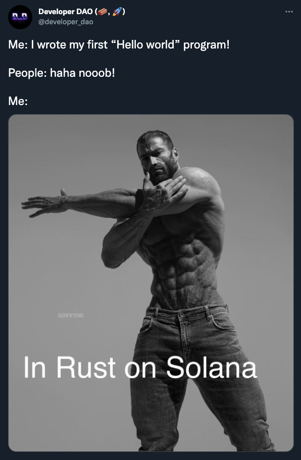
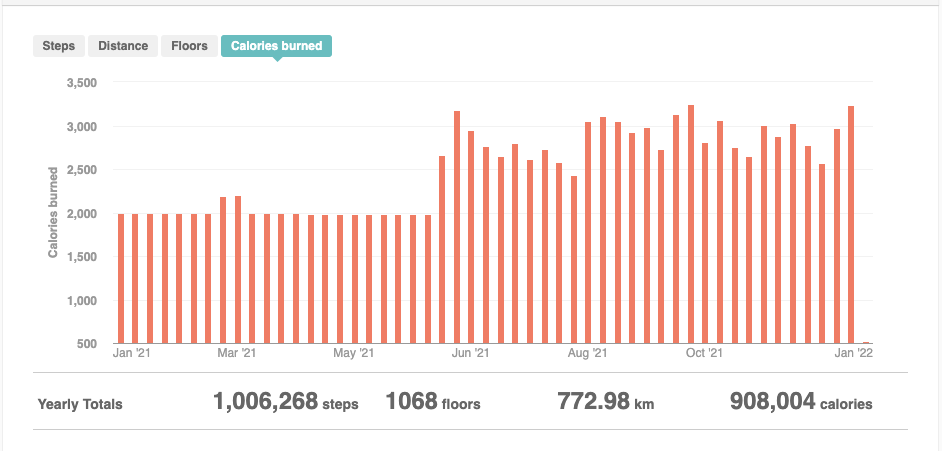
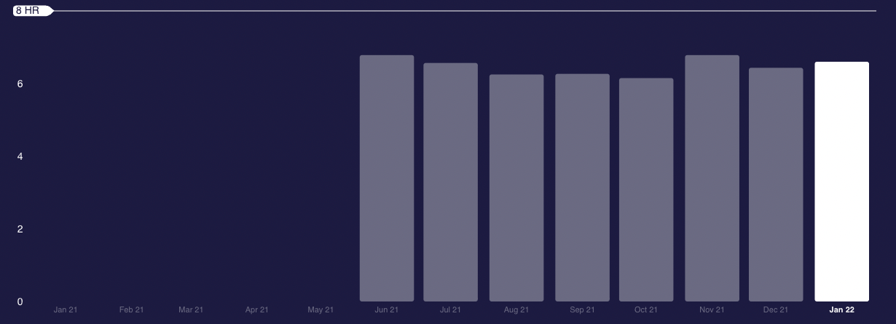
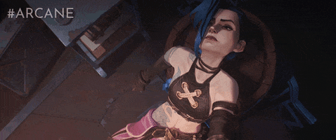

## Intro

This is the first time I decided to write an annual review and hope to make it a habit to do so every year. Last year I jotted a draft but got overwhelmed and didn’t manage to finish it. Somehow it seems like a theme whereas when you take on bigger chunks of work without breaking them down, there is a higher chance of not finishing them.

The main three questions that I am trying to answer here are:

- What went well?
- What went wrong?
- What are the learnings?

These questions are being answered in the context of life areas such as career, growth, health, etc.

This review is based on a template from [Dean Yeong](https://www.deanyeong.com/) and his worksheet which can be found [here](https://www.deanyeong.com/article/2020-review#:~:text=downloadable%20worksheet%20here).

Let’s dive in…

## Main theme

Unless you have been living on a different planet, the world is upside down. I guess what you have been going through really depends in which country you ended up staying but this year seemed even weirder than 2021.

If the first year we were trying to adapt to the consequences of a global pandemic, this year we were clearly **learning to cope and live with it**. Self-pity and 1st world problems aside, I am very privileged and fortunate to be stuck in Singapore where there is always availability of beds for critical cases, medical support, free masks, free vaccines, and help.

## What went well

- Did a lot of introspection and genuinely improved my self-understanding, confidence, and who I am as a person.
- Made to it 2+ years with my GF and going strong into the next year together as a couple.
- Finally started properly investing and saving more to invest.
- Got back to coding and design.
- Exercised at least 4 days a week in Q3 / Q4 of this year and got into shape.
- Made and met several friends over the “interwebz”.
- Invested in Calm Capital and got engaged as a scout to search for profitable companies and founders who want to have optionality.
- Managed to secure a new gig with seemingly great people.
- Started to track things to have a more pragmatic and realistic view of progress.

## What went wrong

- I was hoping to see my family this year but due to family illness and the status of covid in the world, I didn’t manage to go to Europe.
- My career took a dip and I ended up in a nightmare position.
- Didn’t manage to create a writing habit.
- Stressed out over a job and visa status in Singapore.
- Only read 3 books this year (although compensated with lots of good articles - more on that below)
- Sometimes unnecessarily spent money on things I didn’t end up using, which turned into refunds and wasted time.

## Areas

### 👨🏻‍💻 Career 3/10

Wow, this has been a bizarre year work-wise. As I haven’t done a 2020 review, somehow I literally managed to repeat my mistake and landed in a completely nightmare-ish position by not doing my own due diligence on the company, product, and people. Long story short, I think I literally landed on a scam of a company with a completely broken culture and product that was in development for 3 years but still hasn’t been released. This in the end resulted in inflated expectations from investors, unrealistic timelines, uncoordinated executive parties making it harder for each other to work, and ultimately the exit of a person who hired me and convinced me to join.

Consequently, I spent a month interviewing with around 20 companies which has been incredibly stressful and chaotic. It really convinced me that hiring is a completely broken field and frankly, maybe something I would like to tackle one day from the project or start-up perspective.

Another lesson is that benchmarking is a thing. I was lucky enough to land in very healthy places in my early career thinking it’s a norm. Unfortunately, it seems like statistically speaking these places were the tail-end or 1% of the ones that are exceptional but also hard to find.

On the other hand, adversity teaches us new things. In a way, I enforced the thought on myself that the choice of staying in Singapore was more important to me to endure such stress and it was worth it. But I will never cope with such BS ever again. I think a good thing about aging is that the BS tolerance just goes to almost 0.

**Learnings:** Always do thorough due diligence on people, products, and culture during interviews.

### 🌱 Business 1/10

Long story short, this has been a complete failure. I didn’t focus at all on making my second dollar on the internet as I was busy navigating the job challenges, however, I realized that I should have used my time to focus on building a side income stream.

- Published 0 articles
- Didn’t finish an email course
- Newsletter abandoned
- Had to re-start coding to ramp up on potential products (both good and bad)

There is something about the commitment that is so terrifying. Too many areas of interest, too many options, and too many things to do. I have been struggling with this kind of procrastination where I should be working and producing a micro-SaaS or content but instead, I tend to research, get into a rabbit hole (like PKM), and spend weeks if not months on topics that don’t end up being output driven. I spread myself thin…

As Bruce Lee rightly pointed out: “I fear not the man who has practiced 10,000 kicks once, but I fear the man who has practiced one kick 10,000 times.”

**Learnings:** Sometimes call for desperate measures and it is ok to stop whatever you doing to take a breather and deal with life’s challenges to come back on track later.

### 🚀 Growth 7/10

On a positive note, personal growth has been a good area this year. A few things contributed here:

#### Software development

I went back to coding and decided to pursue this activity as a main goal to improve in Q4 this year. It was mostly motivated by going towards the route of [indie-hacking](https://www.indiehackers.com/) and being able to build mini-projects and micro-SaaS. I have been on and off programming for the past 10 years and somehow it always draws me back.
Another interesting paradigm that I observed about programming is that it helps with concentration and works as a training to focus on a challenging task at once.

#### Design

I briefly delved into Figma and UI/UX design to improve my future products. Played with some Bezier curve games and experimented with typography. In combination with coding, design is becoming a superpower, considering how important accessibility and general usability have become.

#### Product management

One of the biggest highlights overall is that I moved to product management. It wasn’t this year - but I properly started managing product managers and coaching people in 2021.

#### Meta

First of all, what is meta? The best way to describe it would be thinking about thinking and expanding the horizons of meta-cognition. The ability to measure improvement usually comes down to being able to answer questions like:

- Why am I feeling this way?
- I have seen this pattern before, what does it mean in this context?
- Was this the right decision to make and if not, what have I learned from it?
- How am I complicit in creating the conditions that I don’t want?
- What haven’t I experienced firsthand that leaves me naive to how something works?
- **What do I think is true** but is actually just good marketing?
- **How much have things outside of my control** contributed to things I take credit for?

_Thanks, [Jerry Colonna](https://www.reboot.io/team/jerry-colonna/) and [Morgan Housel](https://twitter.com/morganhousel) for some of the questions._

I found that the signs of maturity are even the ability to come up with such questions and phrase them in your head. The answers are not always straightforward but it humble you and get you to action on specific things that need improvement.

#### Shipped this year

- [Personal website](/) - I used a template for the site, but I also developed a few of my components and managed to add some sections and elements that helped me to customize the very own site you are reading right now, including the highlighter effect on the front page.
- [Logseq theme](https://github.com/kirso/logseq-panic-theme) - I am very proud of this one because it was my first pull request to contribute to a real-world project. Albeit being small in scope (just some CSS).
- [Open-source calendar](https://calendar.kirillso.com/) - I used the [Cal.com](https://cal.com/) self-hosted solution to host my booking app on the domain. Although Ahrefs audit is constantly complaining about it, it’s a neat thing to send people to book time with me. **UPDATE 2022**: I moved from a self-hosted version of cal.com to a cloud one since the free tier is very generous.
- [Google clone](/posts/google-clone/) - this was based on a Next.js tutorial but I experimented with fetching APIs for the first time.
- [Schwiftyverse](https://schwiftyverse-kirso.vercel.app/) - ok, this was more of a fun project to test out development with React and connect the Solana wallet called Phantom. You can then submit the GIF on devnet with fake SOL, but make sure it’s Rick & Morty related! The website then reads from the blockchain and renders the submitted data on the front end. The cool part is that I learned that Solana distinguishes between the submitted data (immutable) and execution code when deployed that can be changed. I also wrote a [twitter thread](https://twitter.com/kirso_/status/1463049522876071940) about the experience.

Minus points for consumption of too much media and not producing enough output

**Learnings:** Focus on 1 thing at a time and prioritize relentlessly. Don’t spread yourself thin throughout too many projects and take on the one that matters the most.

### ❤️‍🩹 Health and fitness 8/10

One of the biggest highlights of this year is that I finally stopped smoking and have been exercising quite a lot. On the downside, I didn’t keep eating clean, and that contributed to the body fat % not going down as much as I would want to but still solid 8 months of workouts.

#### Physical health

Avg. sleep **6+ hours** - definitely pretty bad and needs improvement

#### Mental health

Overall this year seemed quite ok. I had a few bad days mostly due to my job situation and there was a lot of stress but I didn’t get into severe depression. I did feel homesick this year though which I never felt before.

**Learnings:** Just keep going and don’t break the chain. Don’t go too intense after break time.

### 👥 Relationships 7/10

#### Family

Minus points here as I haven’t been home for around 2 years now. I left Russia in 1999 and have been traveling the world since 2012 after another 12 years in the Czech Republic. The weirdest thing is that the concept of home is blurred for me.

#### Friends

This has been pretty great, I think since I arrived in Singapore, it has been quite easy to meet people considering everyone is speaking the same language and there are tonnes of expats here. Overall what contributes to happiness this year is just having good people around and having dinners, board game nights and just chill hangs together.

#### Partner

Probably one of the bigger highlights is that having a stable partner who constantly uplifts me contributes to my mental well-being. I couldn’t be more grateful and happier and managed to celebrate 2+ years together going stronger for the next one and beyond.

#### Professional network

I didn’t proactively pursue networking with other professionals this year, but mostly because I got overwhelmed with the time it requires to nurture the connections. That’s why I stopped doing [Lunchclub](https://lunchclub.com) meetings.

#### Community

[Code in the community](https://www.saturdaykids.com/social-mission/code-in-the-community/) - I wanted to volunteer to teach kids to code but realized I needed to up-skill myself to a good level first.

[Better.sg](http://Better.sg) - was supposed to join as a product manager on one of the projects but my job troubles started and I just couldn’t allocate more time.
_Proximity_ - made friends with my neighbour whilst going to the same gym, but other than that wasn’t engaged.
_Online_ - part of a few telegram and discord groups for topics like IndieHackers, micro SaaS, learning to code, and creator economy. Met some amazing people online and am happy to call them great community folks who help each other in the journey.

**Learnings:** I got overwhelmed at some point with time and requests to have a call and got protective by saying no. I realized I get a lot of time anxiety with things I want to still achieve but also need to focus and therefore started to reject requests to meet or have a call instead.

### 💰 Money 7/10

#### Savings

I have been diligent in saving and thanks to the ability to increase income in the past 3 years, I have been able to save around 70% of my income per month to then re-invest into active assets.

#### ETFs

Every month I put the majority of my cash into VWRA. The only concern I have right now is that I can potentially get a better risk-adjusted return from DeFi, but I am not comfortable with the security risks posed by these platforms to put my entire retirement investments into

#### Stocks

I don’t invest actively anymore but I have a “gamble fund” which I use to put smaller chunks ($1k-$5k) into individual stocks that I like. I bought $SHOP, $COIN, $U last year.

#### Crypto

The elephant in the room. This probably also requires a separate post, but I sold most of my holdings in August 2021. Took a profit on the first buys I did in 2017 and also reflected on the stupid decisions I made during that time. If I could share one learning, don’t actively trade, you are most likely not be able to beat the index anyway in the **long-term** (think, decade).
**Real Estate -** sold an apartment in the Czech Republic and bought a vacation rental in Spain. The yield on long-term rents is so bad that it doesn’t make any sense anymore.

### 👨🏻‍🎨 Hobby 4/10

The reason why hobby has a separate area is because it has nothing to do with growth. I believe one of the worst things is to conflate things we do for pure enjoyment and play as opposed to the targeted development of skills for output.

My perception of time pushed me to focus on things that I feel are “productive”. It became so unhealthy that the moment I started doing something leisurely, I started to have a voice in my head saying that I should stop slacking. Not super unique if you google this phenomenon, nonetheless a very unhealthy habit I am trying to shake in 2022.

#### Books

This was a disaster. I just couldn’t find any book that really captivated me this year and only managed to read a few fiction ones. Instead, I also started reading tonnes of book summaries. I hope to fix this and read at least 12 books in 2022 by being more intentional about picking books I want to read.

#### Cooking

Somehow I started lacking European cuisine in Singapore (or at least dreading the pricing for some of the dishes which are not far from daylight robbery). I learned how to make:

- Bolognese sauce
- Pesto sauce
- Borscht soup
- Beef stew
- Vegetable risotto
- Proper creamy scrambled eggs
- Palak Paneer
- Butter garlic prawns
- Aglio e olio

## Resources

### 📚 Book

[Leviathan wakes](https://www.goodreads.com/book/show/8855321-leviathan-wakes) (Expanse Series Book #1)

If you love sci-fi, I fell in love with the Expanse TV show and started reading the books. The first one in the series is Leviathan Wakes. You can think of it as a game of Thrones with some conspiracy and a bigger world build-up in space. I am on book #4 right now which is pretty slow but it’s a good and easy read when you don’t need your brain to work too much and just relax.

> Stars are better off without us.

### 🎙 Podcast

[Tim Ferris #555: The Liberation of Cosmic Insignificance Therapy — Oliver Burkeman](https://pca.st/w039bmj4)

> Yet when I surveyed all that my hands had done and what I had toiled to achieve, everything was meaningless, a chasing after the wind; nothing was gained under the sun. - **Ecclesiastes 2:11**

**[#250 – Peter Wang: Python and the Source Code of Humans, Computers, and Reality](https://pca.st/1fq9wxne)**

> We give people the impression that consumption is meaning. We produce different things that are “as-if” meaning, but making decisions without consequences creates a meaning crisis. Choosing between Hermes & Channel is not a consequential decision or a meaningful one and therefore doesn’t satisfy our lives.
>
> Creating an artificial scarcity is bad for society. It renders you captured in the virtual environment.
> The vast majority of people in consumer culture are incentivized by advertising and mimetic environment need to pursue status games as a driver of meaning which is hollow. At the end of the day, it’s like eating sugar since the calories in it have zero nutritional value.

### 🎥 Movie

**[Arcane](https://www.netflix.com/title/81435684)**

An animated masterpiece is definitely the highlight for me. There are not a lot of TV shows or movies I enjoy these days, but this one was just good from the visual perspective but also story wise. The world is captivating, the writing is great and characters are interesting. It is a bit childish, but I held me till the end.

> Loneliness is often a consequence of a gifted mind.
>
> It’s a sad truth that those who shine brightest often burn fastest.

### 📺 Video

[**Rick Rubin: The Invisibility of Hip Hop's Greatest Producer**](https://www.youtube.com/watch?v=vabwGiTWRVo)

> It wasn’t shiny, it wasn’t polished. It was… raw and felt more poetic and personal. No one got into hip-hop at the time thinking it’s going to be their rode to success.

### 📖 Article(s)

[**House money - why our appetite for risk grows with our money.**](https://www.youngmoney.co/p/house-money)

> The more successful you are at something, the more convinced you become that you’re doing it right. The more convinced you are that you’re doing it right, the less open you are to change. The less open you are to change, the more likely you are tripping a world that changes all the time.

[**Is internet addiction eradicating the habit of reading?**](https://benwajdi.com/essays/is-internet-addiction-eradicating-the-habit-of-reading/)

> I think that all it takes to realize the dangers of internet addiction is to watch people around you. Watch how they hold their phones, how they look at their screens, how they scroll down through their feeds, how they jump into watching random stories and videos. If these people are close enough to you, you will begin to notice the influence of their digital habits on their self-image, their life choices, and their goals.

### 🎶 Music

The amazing Above and Beyond set with a view.

## Habits and things I want to do in 2022

- **👨🏻‍💻 Career:**
  - Don’t get fired
  - Improve my technical and execution skills as a PM
  - Improve my managerial competences by helping a colleague to grow
- **🌱 Business:**
  - Earn at least $100 from the internet
- **🚀 Growth:**
  - 365 days of code
  - Write at least 1 essay a month
  - Always keep learning
  - Protect my time by saying “NO” more often
- **❤️‍🩹 Health and fitness:**
  - Exercise at least 3 times a week
  - Note the mental states and how things make me feel
  - Shift to 8 hours sleep on average
- **👥 Relationships:**
  - Meet new people online when relevant (but protect my time)
  - Scout for bootstrapped and profitable companies and engage with founders
  - Contribute to at least one non-profit by helping them out
- **💰 Money**
  - Keep investing in ETFs
  - Make at least one private angel investment
  - Lookout for the break-out investments based on the barbell strategy (put small chunks in risky endeavours).
- **👨🏻‍🎨 Hobby**
  - Take at least on 1 hobby that isn’t related to a screen time (currently its weightlifting but I need something else)
  - Continue playing basketball with friends

## Wrap-up

Funny enough, when I was writing this review I got really overwhelmed (it took me around a week to write). It felt like a dread. It also felt like I have achieved nothing this year. But looking at some of the areas I am actually quite proud that I wasn’t sitting on the sidelines of quarantine just binging Netflix.

As mentioned above, the main theme going forward for me is trying to understand the changing world a bit better. The rules are clearly shifting and there is no university in the world to prepare you for what is coming. The second part is just to be calm and work on things that matter to me and I feel interested in. Sure that’s not a SMART goal, but in the past these kind of goals just put me in depression. I hope to actually be producing more than consuming and in the end contribute with something net-positive to society and if I can only help 1 person - I would consider it a success.

The theme for 2022: **Production! (over consumption)**

If you made it till the end, thank you and see you around!
