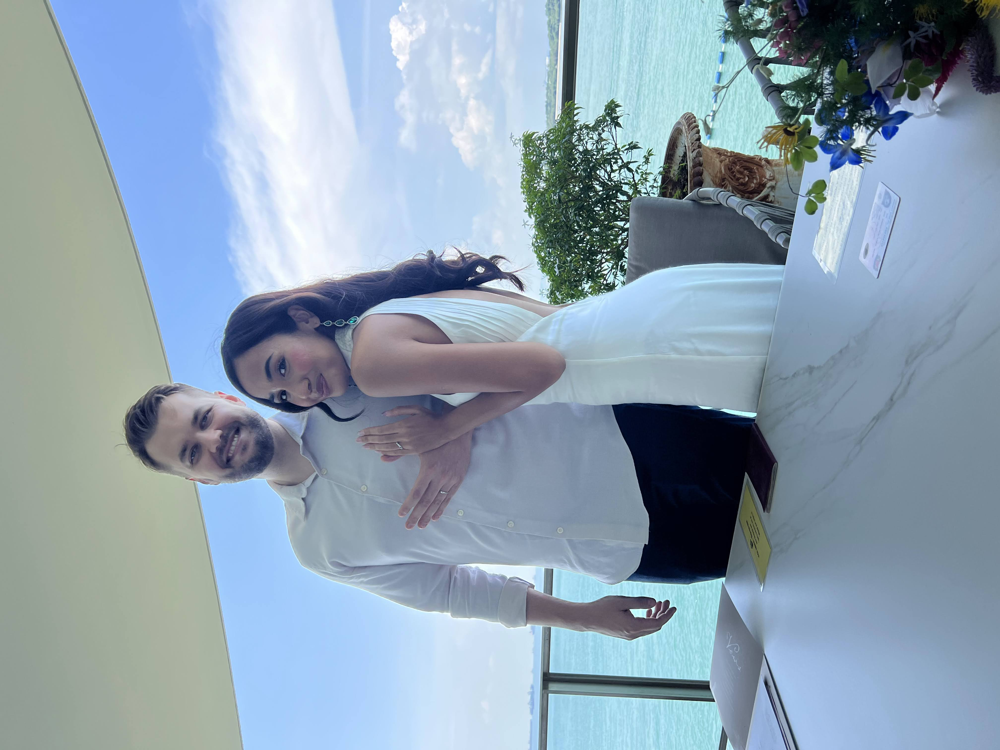

## Prologue

Contrary to most of the world, I am writing my annual review on my birthday (thanks to [Phan Tanh](https://www.tampham.co/) for inspiration).

It kind of make sense… the years you spend on this earth really start when you are born, not when the earth finishes its orbit around the sun.

### The art of reflection, and dread

In 2022, [I attempted](/annual-review-2021) to summarize my year. It was a fairly enjoyable process, but the output seemed like having more relevance to me.

In 2023, despite having good intentions I made a mistake and went too deep. The goal changed from summarizing my learnings and reflect to → “I just want to be done with it”. And such philosophy, my dear friends, is very dangerous. We tend to get into that mode when we are not really connected to what we are doing.

This year I didn’t learn the lesson. I used the same template and dreaded every moment but pushed through. With the same outcome of not being proud of what I’ve done despite sinking 10 hours into the process. I frankly hated it.

So I went out on a search and tried to find if anyone else feels the same way. It appears some dude called [Andrew Askins](https://www.andrewaskins.com/2023-year-in-review-plus-free-notion-template/) shared a similar experience in his blog post. He also managed to simplify it.

Hence, instead of boring you with 9 areas of my life that made me feel cringe, I’d like to go with an alternative to simplify. After all, whoever is reading this is either a person who wants to know if they are ahead, or my wife.

### The why

If you wonder why to even spend time doing something like this, [Ximena Vengoechea](https://www.ximenavengoechea.com/) wrote a great article on life audits where she defines it as:

> An exercise in self-reflection that helps you clear the cobwebs of noisy, external goals and current distractions, and revisit or uncover the real themes & core values that drive & inspire you. **Also known as spring-cleaning for the soul.**

I find this exercise helpful, because the [“zombie-mode”](/posts/avoiding-zombie-apocalypse/) switches on at some point and its very hard to notice “when” that happens. A good indication.

### The structure

## [TLDR](#tldr)

- [What went well? (Highlights)](#what-went-well)
- What didn’t go well? (Lowlights)
- What did I learn? (Lessons)
- Core memories (Moments of awe)
- Systems & values

### TLDR

2023 was a year of **stability** and **experiences** and such as every year there were both upsides and downsides.

I had major life events happen, including making the most important decision of my life as well as unintentionally creating lots of memories. I travelled a lot, and it felt like the old days, just without all the meetings I had to go to as it wasn’t related to my job. Furthermore, I focused on my health, eating habits and gym consistency, whilst trying to carve out some time for nourishing some of my life’s most significant relationships after the long hiatus of post-COVID world.

Overall it has been a very good year, not without challenges but as usual I learned a lot…

## What went well

### Getting married

They say who you marry will pretty much dictate the quality of your life…

Well last year in May, [Sarah](www.sarahkhanamajid.com) and I, decided to make it official and signed papers at a local ROM (registry of marriage) in Singapore. We didn’t have a proper ceremony yet, which is planned for this year and will only appear as life event in the next review.

Our relationship has been defined first by randomness that turned into fast-track bootcamp in 2020 where we moved in together in the middle of the pandemic. We were isolated from the outside world for at least a year in a small studio apartment in the east of Singapore. Despite that fact and being very early in, we managed to make it work, in fact it was really fun.

When the borders opened, we started to finally enjoy what other couples usually start with. Dates, travels, restaurants, and hangouts with friends.

I am incredibly humbled and grateful that I have a person in my life who is kind, generous, supportive, and full of infectious optimism and zest for life. As her sister likes to say, she brings “color” into my life.

### Experiences and travel

Last year was rich. Like super rich in things we did in our personal life

### Stability (with a caveat)

## What didn’t go well?

### Auto-mode

When the review time came, it was really hard for me to recall all the major things that had happened.

[talks about it](https://omnivore.app/kirso/this-moment-is-your-life-nat-eliason-s-essays-18e121f0b9f)

### Growth

###

## Learnings

### General

- I learned a lot about how networks and the internet work at a low level in my time at GreyNoise.
- I learned that I can survive a big professional failure, and that as long as I live by my values and treat people with respect that will ultimately be more important to the people around me than the failure was.
- I learned that not only CAN I walk across a country, I LOVE the simplicity and the community and the challenge that come with a big through hike.
- I learned that I shouldn’t be afraid of crowds on big through hikes, because the people are the best part. Walking the Appalachian Trail is my newest big audacious goal (although not for this year).
- I learned that, at least for now, I want to be a founder and not an employee.

### What I changed my mind

Throughout the year

### What did I not do because of fear

<https://www.shaanpuri.com/parents>

## Core memories

- All the Bali trips
- Restarted my journey to become technical and being able to code with Lau
- Trip to Bangkok to see Arctic Monkeys
- Celebrating our birthdays with [Sarah](www.sarahkhanmajid.com) and friends
- Reached 100% heart rate during fitness workout
- Getting married
- Men, I Trust concert
- Trip to Langkawi, Malaysia
- Played tennis after a decade
- Applied for PR
- Meeting new internet friends
- Trip to Ho Chi Minh and Cam Ranh for friend’s wedding
- Trip to Taiwan
- Trip to Chiang Mai
- Trip to Similan Islands and new years on the boat

## Systems (for 2024)

### 2023 Goals

#### Theme:

I did pretty well with my 2023 goals. Hiking the Camino, surprising Maddy, and sticking to Spanish lessons for most of the year were big achievements. I didn’t climb as much as I had intended, but I did pick up weightlifting for a bit and really enjoyed that again. And I don’t think I built emotional resilience, or at least not at the level I would like to have gotten to. But I did weather some big life changes and challenges, so that is really the only way to practice.

### 2024 Goals

#### Theme: Take a break

- X

## Resources

- Life audit by Ximena
- 6 questions by Dexter Zhuang
- Andrew Askins
- Steve Schlafman

## Acknowledgments

A non-extensive list of people that I owe my thank you:
