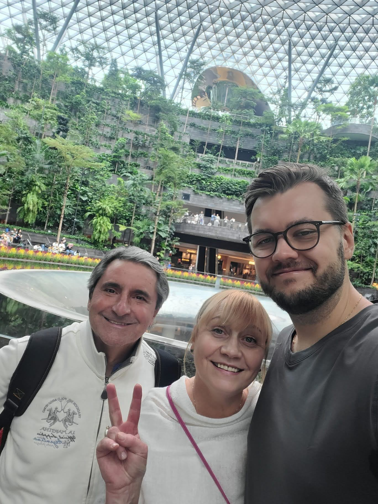
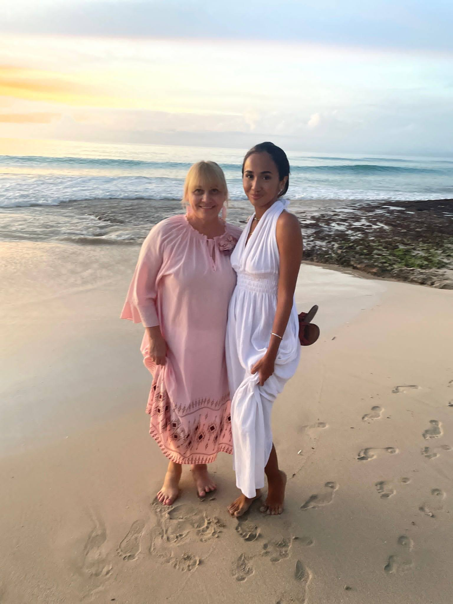
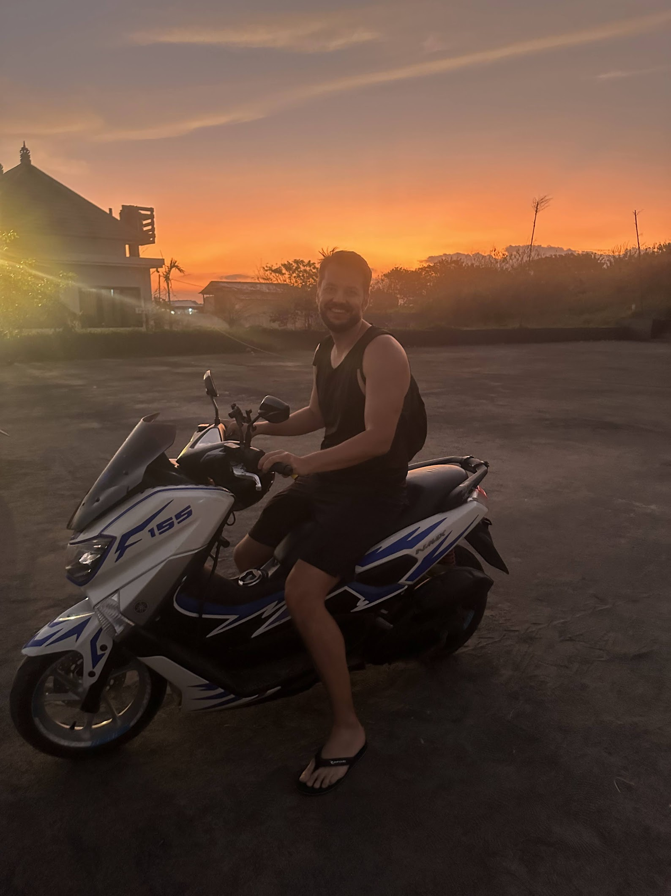
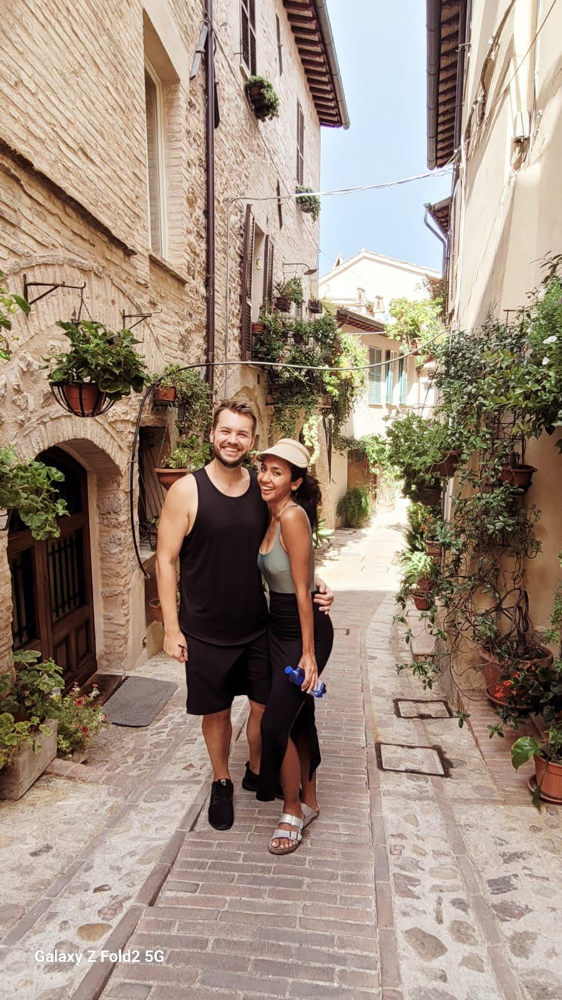

What a year! Since 2021 I wrote annual reviews (although I didn’t publish all of them). Its a nice exercise to reflect, remember and see if I am on track mostly towards living the life in accordance with my values.

## TL;DR

2024 was my year of extreme **highs and lows**.

This year I’ve lost a bunch of weight, had a wedding, spent family time abroad, became a digital nomad and had a really hard time at work whilst working on myself and my relationship.

It was one of the most intense years of my life, but also one of the most meaningful ones.

## Highlights

### Family visit in Singapore and Bali

My mum and her husband visited me in Singapore. It was their first time so I finally had an opportunity to do all the touristy things that I never got to during my 5 year tenure in the country. We walked, ate, talked and laughed a lot whilst letting them experience the culture shock for the first time in Asia.

As we reach a certain age, it is inevitable to start thinking about our time with our family. This realization hit me just recently when my mum turned 60 this year. This really shocked me. Not that its an extreme age, but I didn’t think about it much up until now. When you try to put a number, here is a wake-up call quote from a [BigThink article](https://bigthink.com/thinking/how-many-times-will-you-see-your-parents-before-they-die/):

> Let’s assume your parents are in their mid-60s, and let’s assume you see them four times a year—such as at birthdays, during the holiday season, or at special events like weddings. Working on an average life expectancy of around 80 years, that means you will only see your parents between 50 and 60 more times.

As the article also points out, the life “todo” list never gets shorter and we will never have anything under control. We will always be busy, have things to do, people to meet and some other work that is waiting.

So what is the antidote? Considering the time is limited and we cannot control the finite nature of it, the best we can do is to acknowledge it and try to spend more meaningful and mindful time with our folks. As a bonus we should get to know them better, I am sure there are some things you’ve never thought of asking them or don’t know about them. Here are a few prompts:

- _What were your happiest moments growing up?_
- _Who’s been the best friend over the course of your life?_
- _When did you first fall in love? What did it feel like?_
- _What’s your biggest regret?_
- _What did you learn the most from your own parents?_

I am proud and immensely grateful to say that I managed to squeeze in almost 4 full months with my folks this year and it has been a fragment of time I will remember forever. It is a challenge to maintain this pace with all the life responsibilities but I hope to keep reminding myself of what truly matters in life.

### Digital nomad life

This is the 3rd time I left all my belongings (which don’t account for much) and embarked on a travel journey. There is already a lot written about the lifestyle and I’ll also keep it for another post but it is not all sunshine and rainbows as many have pointed out. There is definitely a part in freedom and flexibility, but I spent most of my time working and waking up at 5am which means by 8pm I’d already have no energy in the tank. Locations really matter and I struggled with diet and exercise in Italy as well as not having my support system around. I’ll write a more extensive blog post but for now, here is an outline of itinerary and memories:

January:

- Similan islands, Thailand - new years eve on the boat with my wifey’s family.
- Singapore - doing touristy walks in Singapore with my mom and her husband. I got to finally see the domes, the zoo and attend a tea ceremony.

February:

- Bali, Indonesia - a family trip to Ubud and Uluwatu. Walking in the rice fields and enjoying the food and some of the tourist locations that are quite overcrowded.

March:

- Singapore - hustling at work and spending time with our friends and saying goodbye for now.

April:

- Singapore - Celebrating our joint birthdays with my wife and packing up to move out from our apartment of 3 years.

May:

- Bali, Kerobokan, Indonesia - Focusing on diet and exercise whilst wedding planning and working unreasonable hours.

June:

- Bali, Nusa Lembogan, Indonesia - Driving around the island on a scooter, doing enneagram exercises with Sarah and celebrating our anniversary.

July:

- Bali, Kerobokan, Indonesia - Our first dancing lessons with wonderful [Luka](https://www.instagram.com/lukafanni/reel/C52lHIPPMHy/?hl=en) and Just Dance Bali!
- Rome, Italy - Staying with my family, visiting nearby towns and eating good food.
- Sperlonga, Italy - visiting a coastal town and tasting freshly made mozzarella from a local factory.

August:

- Umbria, Italy - Ferragosto holidays in agro-hotel and touring nearby towns Gubbio, Assisi, Spello and Perugia.
- Rome, Italy - welcoming our friends from around the world in Rome and our wedding day including the evening dinner before and waking up in the morning at [Antico Borgo di Sutri](https://www.anticoborgodisutri.it/) and seeing all our closest ones still around.

September:

- Frascati, Italy - staying at a country house [Erba Regina](https://www.countryhouseerbaregina.com/en/) with Sarah’s parents and enjoying post-wedding downtime.
- Ischia, Italy - a trip to the south of Italy for my moms 60th birthday and celebrating together. Also getting lost on my hike and eventually making it back home with no battery after 6 hour walk.
- Napoli, Italy - eating our hearts away in the center of pizza land and meeting Luca in person after 3 years of random reddit encounter 😂.
- Milan, Italy - visiting Sarah’s friend in Milan during fashion week and a day trip to lake Como.
- Pisa, Italy - a day trip to see the tower and taste the local delights.
- Viareggio, Italy - downtime in a coastal town before further traveling with amazing sunsets.

October:

- Florence, Italy - last stop of the trip in the center of renaissance, art and culture.
- Bangkok, Thailand - finally settling in one place and having a routine.

November:

- Khao Yai, Thailand - amazing time with friends, nights full of stars in a national park, hiking trails and a shock wild elephant encounter with our friends that we’ve decided to commemorate with an [ai song](https://suno.com/song/7cd1ebd8-a752-4b67-88a3-429d34fbefc7).

December:

- Kuala Lumpur, Malaysia - my first Indian Punjabi wedding experience. 4 days of socializing, respecting traditions and experiencing a new culture.
- Singapore - work and admin visit.
- Phuket, Thailand - settling down for a few months for an island life and downtime to reflect and write.

A few photos from the trips (Bali sunset, walking the streets of Spello and smurf commando in Khao Yai)

### Wedding

I wasn’t keen at the beginning and wanted to elope. Eventually I caved in and was happy about the decision. A few reasons here (all stolen from [this article](https://moretothat.com/why-having-a-wedding-makes-sense/), thank you Lawrence):

- Wedding day is like an IPO in your happiness portfolio - sorry for a LinkedIn lunatics like reference but hear me out - people took time to book flights, travel 8000km, book accommodation and put a massive effort and intention to be part of the day despite spending 2 minutes with the groom and bride. Its a celebration of unity but also people around us who shaped us.
- A solidified memory of support - goes without saying, we still look at pictures and messages our friends wrote to us in a book and the tears keep flowing.
- Planning process with the spouse - I actually really enjoyed doing this as an activity since Sarah was the main wedding planner and I was the junior assistant. The process revealed a lot about our dynamics and things we are good at as well as things we need to improve.
- Lastly, there are usually only 2 days in life where everyone you know comes together to say either “congratulations” or “goodbye”. As morbid as it sounds, it was quite a big one to make the decision easier.

The feeling that day was electrifying and I tend to share that being on the other side of the isle and seeing the bride come to you made me feel things I never thought I would ever feel. Despite a lot of stress and planning going into a few hours, seeing all our friends and family being there for us made the day special and words don’t do it justice.

Despite us being married officially for a while, the culmination of various events in Italy has made a huge mark on this year and also followed by the period of relief after a very busy schedule. A big kudos to my wife planning the wedding remotely, in a foreign country with some vendors not speaking english, and putting all the pieces together. We wouldn’t be able to pull it off without the help of our family and friends and hence I extend huge gratitude to everyone who made the trip and supported our relationship throughout the years.

## Other mentions

### Massive weight loss

This probably also deserves a separate blog post, which I am planning to write but my entire life I’ve struggled with overeating and weight control. Before leaving Singapore, I was around 100kg which at my height at the time put me at slightly overweight state. By the time it was the day to walk down the isle, I managed to drop to 83kg.

It took a lot of psychological conditioning and dissatisfaction to take action. Nevertheless, its totally possible with some key elements like calorie counting and strength training whilst eating enough protein in order to maintain muscle mass (which was the main challenge). The most important part is that despite losing so much weight, most of it was fat % and that is the trickiest.

### Working on thyself and couple relationshp

This year I’ve started a journey to uncover my blind spots. I’ve struggled to find a coach and a mentor to guide me through all of my uncertainties and questions and eventually randomly stumbled upon [Sasha](https://www.sashachapin.com/) (ironically by looking for a writing coach for my wife). We’ve worked through various challenges I was having, touching on personality, enneagram types, IFS and parts work, feeling of safety, inertia and meditation. It has been a new thing me, and I really enjoyed it. There is something deeply uncomfortable trying to look inwards to untangle the tension. I am still at the beginning of this journey, combined with the couple counseling it however uncovered things I’ve never known about myself.

## Lowlights

### Professional workload and burnout

My job has picked up in Q3 and not in a pleasant way. Main priority project of the organization fell on my shoulders and had to get done with very strict deadlines and uncertainties. I am usually open to challenges with open arms but coupled with travel and wedding planning, the outcome was 16+ hour workdays.

This also resulted into an unhealthy loop of mostly days focused on work and no brain capacity to do anything else but leisure. I’ve managed to be able to rest in the evenings and make sure to workout, but anything else cerebral like reading, coding, writing took a backseat.

Then 2 things happened:

1. Frustration due to unrealistic expectations
2. Burnout (or very close to it)

I’ve battled both around mid-year until things got even busier and there was nothing else to do to just concede on doing “more” this year and trying to make it through.

### Face to face time with friends and isolation

Being remote is awesome, but I missed my crew and in-person catchups. Relationships are hard to build online and I was fortunate to find a good bunch of people. Maintaining them though is not such an easy feat. My effort went into scheduling catch-up calls despite knowing that relationships are built on shared experiences and events. I am not sure how to tackle this yet, but for now the best bet is staying proactive with people I hold dear.

## Lessons

### Asymmetry between attention and interesting insight

Topics with rich and profound insights often go under-explored, lacking sensationalism required to command widespread interest. Conversely, many things we see as mainstream lack depth and usefulness due to prevailing narratives. Most of my life I’ve operated under the premise of what is “picking up” right now and then focus relentlessly at understanding it which eventually led to a lot of professional opportunities. These days I don’t spread my attention too thin and still tinker around with things like new AI IDEs, frameworks but I am not jumping with full-force on the first thing that is hyped. My signal versus noise radar is tad better these days and hopefully can serve me even better in the future.

### An invisible grip of fear and sunk cost fallacy

The hardest lesson I’ve learned perhaps not specifically this year, is the fear followed by inaction. Whenever something held me back and I didn’t do what I intended to do was mostly due to irrational fear of consequences. When I was younger, I didn’t hesitate to cut things loose to restart either in a different country or a new career without thinking about consequences of what society would think of me. There was always a sort of optimistic naiveté of youth that believed that I’ll somehow end up in a better place. Sadly, I think this boldness disappears with experience. When we aggregate more resources whether its career capital or wealth, the thought of losing it is paralyzing, provided the investment (sunk cost). So moving forward, I will aim to rebuild the inner trust in my decisions and internal compass.

### Finding patterns in randomness

I struggle with accepting average outcomes, which leads to seeking patterns in situations where randomness prevails. Attempting to outsmart the average by predicting non-existent patterns is however a flawed strategy. Even when patterns do exist, timely feedback is crucial, especially in long-term games. This was especially prevalent in the investment category where I abandoned stock picking and buying individual stocks whilst sticking to ETFs and having a small portion of allocation going to riskier assets.

## Life dimensions

| Area          | Score | Comment                                                 |
| ------------- | ----- | ------------------------------------------------------- |
| Work          | 2/5   | Overworked and burned out                               |
| Money         | 4/5   | Saved but should have invested more                     |
| Health        | 2.5/5 | In good shape, but mental health took a dip             |
| Relationships | 4/5   | Thriving, but less face to face time                    |
| Growth        | 3/5   | Worked on myself, but with limited energy and time      |
| Play          | 3.5/5 | Revisited old hobbies such as tennis and video games    |
| Spirituality  | 2/5   | Mediated inconsistently, without deepening the practice |

## Consumption

### Books

#### Dune (4/5)

I didn’t read much this year. But after Dune: Part two came out and I was absolutely mesmerized in the cinema I just had to pick it up. I am not fully finished yet but so far despite knowing the story, I can see how the book combines successful sci-fi elements (flora and fauna, how suites are made, how spice is harvested etc.) with the political intricacies of the main story and characters. Its a fascinating universe, interestingly using phrases from various languages including “kindjal” which means a weapon with up to 40cm straight or curved blade in Russian and also references the same type of weapon in the book. There is more linguistic play here with Hebrew and Arabic references as well as broader thematic explorations of influence, control and the nature of humanity.

[Dune on Goodreads](https://www.goodreads.com/book/show/44767458-dune)

### Course

#### Generative AI mini-simulator for PMs by GoPractice (4/5)

I didn’t manage to do a lot of studying since embarking on LaunchSchool last year but at the end of the year I’ve taken Generative AI for PMs which was very decent. There is one part of the course that didn’t sit very well with me about data visualization that seemed to be out of place but otherwise its worth it.

[Simulator GoPractice link](https://gopractice.io/course/genai/)

### Movie

#### Monkey man (4.5/5)

With a notable sci-fi mentions such as Dune: Part two and Coherence that is dealing with topics such as convergence of alternate realities, the movie that stood out the most for me was Monkey Man with incredible Dev Patel. This movie blends a John Wick style action which Indian culture references such as epic of Ramayana about Hanuman (hindu monkey god), caste and inequality, portrayal of hijras (a 3rd gender community) and taking a shot at extremism and general societal divisions.

### TV Show

#### For all mankind (5/5)

Imagine a universe where the moon landing happens but US didn’t make it first. In this alternate reality the space race continues and every season showcases the next step in progress towards exploration. I think part of what makes this show fantastic is character development and storytelling with engaging script, beyond just the typical sci-fi nerd stuff.

### Game

#### Disco Elysium (5/5)

What could be better than a noir detective story with RPG elements. This game has almost no action and is played based on role-playing conversations (which trigger certain actions). You wake up as drunk detective with memory loss and your limbic system talking to you. The gameplay revolves around conversations with your emotions, trying to solve a murder whilst having a massive disadvantage in one of the areas of expertise (logic, sensitive and physical) and interacting with various characters in a world full of interesting lore and political opinions. ​P.S. - Cyberpunk 2077 came close second.

### Music

#### Simon Doty - Universal Language album (5/5)

This mix from Simon Doty was keeping me in the deep work state throughout the year. Its a solid progressive house style set with some energetic beats and vocals to keep you company and don’t let you fall asleep whether its coding, writing or doing some generic work on a laptop.

### App

#### The Way (4/5)

I’ve tried many apps but none of them stuck and I got quickly overwhelmed by the sheer number of categories, lessons and wasn’t sure what is the next lesson to level up. The way completely removes the noise by having a very specific path. You can’t progress unless you finished a previous exercise, there are no other paths you can take until the retreat is done (except for online/live events). This really minimizes optionality and overwhelm. What is even more admirable, is that it is led by a zen teacher [Henry Shukman](https://henryshukman.com/), who is no stranger to awakening. [Here is an interview with Kevin Rose](https://www.kevinrose.com/p/the-path-to-awakening-meditation?publication_id=2776405&post_id=151771632&r=8qdg&triedRedirect=true) if you want a sneak peak into Henry’s thoughts and methods.

[Free 30 meditation sessions](https://the-way.app.link/gift)

## Looking ahead to 2025

### Principles

- **Live simply:** eliminate excess to focus on what’s essential.
- **Grow continuously**: Learn and improve, always with integrity.
- **Forge your path**: Courageously follow your unique vision.

### Focus

- Health
  - Keep below 20% body fat
  - Grow my muscle mass by 3kg starting from 40kg skeletal muscle mass
  - Play tennis at least 50 times in 2025
- Growth
  - Write 12 articles on topics that interest me, learnings or my past self advice
  - Improve my technical skills by taking at least 1 course on the topic of interest
  - Improve my soft skills by taking at least 1 course (most probably Ultraspeaking)
- Work
  - Release at least 1 project with a payment link that is finished end to end (use AI if necessary)
- Money
  - Save 70% of my income
  - Invest 50% of my income into ETFs
  - Make at least 1 risky bet at a max value of 5% of my portfolio
- Relationships
  - Keep in touch with my friends depending on the frequency level (1m, 3m, 6m)
  - Make at least one more meaningful connection this year
- Play
  - Attend a cultural event / concert
  - Finish at least one 10/10 entertainment value (game, tv show, movie)
- Spirituality
  - Attend my first retreat (already planned [Cambodia](https://hariharalaya.com/yoga-retreat/) in February)
  - Meditate for 150 days a year

## Conclusion

Lookin back at 2024, I am embraced the non-linearity of life. Amidst the zig zags, time spent with family reminded me of life’s fleeting nature, prompting the importance of presence and meaningful connections. This year tested and challenged my resilience and adaptability, both physically and mentally. It underscored my commitment to rebalancing work with personal well-being.

As I look to 2025, I would like to foster more harmony with the principles and focus on what truly matters. Thank you to everyone who accompanied me on this journey—your presence enriched my experiences beyond measure.
