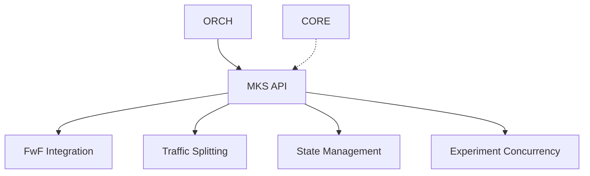

## Table of Contents

1. [Introduction](#introduction)
2. [Project Setup](#project-setup)
3. [Supabase Setup](#supabase-setup)
4. [OpenAI Setup](#openai-setup)
5. [Generating and Storing Embeddings](#generating-and-storing-embeddings)
6. [Implementing the Svelte Chat Component](#implementing-the-svelte-chat-component)
7. [Creating the API Endpoint](#creating-the-api-endpoint)
8. [Implementing Rate Limiting](#implementing-rate-limiting)
9. [Integrating the Chat Component](#integrating-the-chat-component)
10. [Testing and Debugging](#testing-and-debugging)
11. [Deployment Considerations](#deployment-considerations)
12. [Conclusion](#conclusion)

## Introduction

As a sworn nights & weekends builder and tinkerer I wanted to improve my astro based website and make it a bit more interactive. I already managed to figure out how to serve static content but making the personal space a bit more dynamic and playing between SSR and SSG states was the ultimate goal whilst trying some shiny new toys (and hence creating some unnecessary but cool dependencies).

This project allowed me to dive deeper into several exciting technologies: Astro, Svelte, OpenAI, Upstash, Supabase & Cody (Sourcegraph).

In this comprehensive guide, I’ll walk you through the process of creating a chat interface where visitors can ask questions about you and your work. They will then receive AI-generated responses based on the content of your CV or any other text you choose to use as a knowledge base.

This project combines several key components:

1. A Svelte-based chat interface for a smooth user experience
2. An Astro API endpoint to handle requests
3. OpenAI for generating embeddings and chat responses
4. Supabase for storing and retrieving embeddings
5. Streaming responses for real-time interaction
6. Rate limiting to prevent abuse

By the end of this tutorial, you’ll have a fully functional AI chat component that you can customize and integrate into your own Astro website.

## Project Setup

Let’s start by setting up our project and installing the necessary dependencies.

### Step 1: Create or Use an Existing Astro Project

If you don’t already have an Astro project, you can create one using the following command:

```bash
npm create astro@latest
```

Follow the prompts to set up your project. If you’re adding this to an existing project, navigate to your project directory.

### Step 2: Install Dependencies

We’ll need to install packages to make our AI chat component work. Run the following command in your project directory:

```bash
npm install @astrojs/svelte svelte openai @supabase/supabase-js @upstash/redis @upstash/ratelimit
```

This command installs:

- `@astrojs/svelte` and `svelte` for our chat component
- `openai` for interacting with the OpenAI API
- `@supabase/supabase-js` for our database interactions
- `@upstash/redis` and `@upstash/ratelimit` for implementing rate limiting

### Step 3: Configure Astro

Now, we need to update our Astro configuration to use Svelte. Open your `astro.config.mjs` file and modify it as follows:

```javascript
import { defineConfig } from "astro/config";
import svelte from "@astrojs/svelte";

export default defineConfig({
	integrations: [svelte()],
	// Your other configurations...
});
```

This configuration tells Astro to use the Svelte integration, allowing us to create and use Svelte components in our Astro project.

### Step 4: Set Up Environment Variables

Create a `.env` file in your project root if you don’t already have one. We’ll add our API keys and other sensitive information to this file later.

```bash
touch .env
```

Make sure to add `.env` to your `.gitignore` file to prevent sensitive information from being committed to your repository.

With these steps completed, we’ve laid the groundwork for our AI chat component. In the next section, we’ll set up our Supabase database to store and retrieve embeddings.

## Supabase Setup

Supabase is a powerful, open-source alternative to Firebase that we’ll use to store our embeddings. In this section, we’ll set up a Supabase project and create the necessary table for our embeddings.

### Step 1: Create a Supabase Account and Project

1. Go to [Supabase](https://supabase.com/) and sign up for an account if you haven’t already.
2. Once logged in, click on “New project” to create a new Supabase project.
3. Give your project a name and set a secure database password. Make sure to save this password as you’ll need it later.
4. Choose a region closest to your target audience for optimal performance.
5. Click “Create new project” and wait for the setup to complete.

### Step 2: Set Up the Embeddings Table

Now that we have our Supabase project, let’s create a table to store our embeddings:

1. In your Supabase project dashboard, go to the “Table editor” section.
2. Click on “New table” and name it `embeddings`.
3. Add the following columns to the table:
   - `id` (type: int8, primary key, default: auto-increment)
   - `created_at` (type: timestamp, default: now())
   - `embedding` (type: vector(1536))
   - `text` (type: text)
4. Click “Save” to create the table.

Note: The `vector(1536)` type is specific to storing OpenAI’s embeddings, which have 1536 dimensions.

### Step 3: Enable Row Level Security (Optional but Recommended)

To secure your data, it’s a good practice to enable Row Level Security (RLS):

1. In the table editor, go to the “Authentication” tab.
2. Enable RLS for the `embeddings` table.
3. Create a policy that allows read access to all authenticated users:
   - Click “New Policy”
   - Name it “Allow read access”
   - For “Target roles”, select “authenticated”
   - Set the “Policy definition” to: `(auth.role() = 'authenticated')`
   - Under “Using expression”, select “SELECT”
   - Click “Review” and then “Save policy”

### Step 4: Create the Supabase Client

Now, let’s create a Supabase client that we’ll use in our application. Create a new file `src/lib/supabaseClient.ts` with the following content:

```typescript
import { createClient } from "@supabase/supabase-js";

const supabaseUrl = import.meta.env.PUBLIC_SUPABASE_URL;
const supabaseKey = import.meta.env.PUBLIC_SUPABASE_ANON_KEY;

export const supabase = createClient(supabaseUrl, supabaseKey);
```

### Step 5: Add Supabase Environment Variables

Add your Supabase URL and anon key to your `.env` file:

```env
PUBLIC_SUPABASE_URL=your_supabase_project_url
PUBLIC_SUPABASE_ANON_KEY=your_supabase_anon_key
```

You can find these values in your Supabase project settings under “API”.

With these steps completed, we’ve set up our Supabase project and created the necessary infrastructure to store and retrieve our embeddings. In the next section, we’ll set up OpenAI to generate these embeddings.

## OpenAI Setup

OpenAI’s powerful language models are at the core of our AI chat component. We’ll use their API to generate embeddings and create chat completions. In this section, we’ll set up our OpenAI account and configure our project to use the OpenAI API.

### Step 1: Create an OpenAI Account

1. Go to [OpenAI's website](https://openai.com/) and sign up for an account if you haven’t already.
2. Once logged in, navigate to the API section.

### Step 2: Generate an API Key

1. In the OpenAI dashboard, go to the “API Keys” section.
2. Click on “Create new secret key”.
3. Give your key a name (e.g., “Astro Blog Chat”) and create it.
4. Copy the API key immediately and store it securely. You won’t be able to see it again!

### Step 3: Add OpenAI API Key to Environment Variables

Add your OpenAI API key to your `.env` file:

```js
OPENAI_API_KEY = your_openai_api_key_here;
```

Remember, never commit your `.env` file to version control.

### Step 4: Install OpenAI Node.js Library

We’ve already installed the OpenAI library in our project setup, but if you haven’t, you can do so with:

```bash
npm install openai
```

### Step 5: Create an OpenAI Client

Create a new file `src/lib/openaiClient.ts` to initialize the OpenAI client:

```typescript
import OpenAI from "openai";

const openai = new OpenAI({
	apiKey: import.meta.env.OPENAI_API_KEY,
});

export default openai;
```

This client will be used to interact with the OpenAI API throughout our application.

### Step 6: Test the OpenAI Connection

To ensure everything is set up correctly, let’s create a simple test script. Create a new file `scripts/testOpenAI.mjs`:

```javascript
import OpenAI from "openai";
import dotenv from "dotenv";

dotenv.config();

const openai = new OpenAI({
	apiKey: import.meta.env.OPENAI_API_KEY,
});

async function testOpenAI() {
	try {
		const completion = await openai.chat.completions.create({
			model: "gpt-3.5-turbo",
			messages: [{ role: "user", content: "Hello, OpenAI!" }],
		});

		console.log("OpenAI Response:", completion.choices[0].message.content);
	} catch (error) {
		console.error("Error testing OpenAI:", error);
	}
}

testOpenAI();
```

Run this script to test your OpenAI setup:

```bash
node scripts/testOpenAI.mjs
```

If everything is set up correctly, you should see a response from OpenAI in your console.

With these steps completed, we’ve successfully set up our OpenAI integration. We’re now ready to use OpenAI’s powerful models in our AI chat component. In the next section, we’ll focus on generating and storing embeddings using OpenAI and Supabase.

## Generating and Storing Embeddings

In this section, we’ll create a script to generate embeddings from your CV or any other text you want to use as a knowledge base, and then store these embeddings in our Supabase database.

### Step 1: Create the Embedding Generation Script

Create a new file `scripts/generateEmbeddings.mjs` in your project root:

```javascript
import { createClient } from "@supabase/supabase-js";
import OpenAI from "openai";
import fs from "fs";
import dotenv from "dotenv";
import path from "path";

dotenv.config({ path: path.resolve(process.cwd(), ".env") });

const supabaseUrl = import.meta.env.PUBLIC_SUPABASE_URL;
const supabaseKey = import.meta.env.PUBLIC_SUPABASE_ANON_KEY;
const supabase = createClient(supabaseUrl, supabaseKey);

const openai = new OpenAI({ apiKey: import.meta.env.OPENAI_API_KEY });

async function generateEmbeddings() {
	const cvPath = path.join(process.cwd(), "src", "assets", "resume.md");
	const cvText = fs.readFileSync(cvPath, "utf8").trim();

	if (cvText.length > 0) {
		try {
			const response = await openai.embeddings.create({
				input: cvText,
				model: "text-embedding-ada-002",
			});

			if (response.data && response.data.length > 0 && response.data[0].embedding) {
				const embedding = response.data[0].embedding;

				const { data, error } = await supabase
					.from("embeddings")
					.insert([{ embedding, text: cvText }]);

				if (error) {
					console.error("Error storing embedding in Supabase:", error);
				} else {
					console.log("Stored embedding for the CV text.");
				}
			} else {
				console.error("No embedding found in OpenAI response");
			}
		} catch (error) {
			console.error("Error generating or storing embeddings:", error);
		}
	} else {
		console.warn("The CV text is empty. Nothing to process.");
	}
}

generateEmbeddings();
```

### Step 2: Prepare Your CV or Knowledge Base Text

Create a file `src/assets/resume.md` (or whatever name you prefer) and add the content you want to use as your knowledge base. This could be your CV, a description of your work, or any other relevant information.

### Step 3: Run the Embedding Generation Script

Execute the script to generate and store the embeddings:

```bash
node scripts/generateEmbeddings.mjs
```

This script will:

1. Read the content of your resume.md file
2. Generate an embedding using OpenAI’s API
3. Store the embedding and the original text in your Supabase database

### Step 4: Verify the Stored Embeddings

Check your Supabase dashboard to ensure the embeddings were stored correctly:

1. Go to your Supabase project dashboard
2. Navigate to the “Table editor”
3. Select the “embeddings” table
4. You should see a new row with the embedding and the text from your resume.md file

### Step 5: Update the Embedding Generation Script (Optional)

If you want to generate embeddings for multiple sections or documents, you can modify the script to handle this. Here’s an example of how you might do this:

```javascript
// ... (previous imports and setup)

async function generateEmbedding(text) {
	const response = await openai.embeddings.create({
		input: text,
		model: "text-embedding-ada-002",
	});
	return response.data[0].embedding;
}

async function generateEmbeddings() {
	const documents = [
		{ name: "resume", path: "src/assets/resume.md" },
		{ name: "about", path: "src/assets/about.md" },
		// Add more documents as needed
	];

	for (const doc of documents) {
		const text = fs.readFileSync(path.join(process.cwd(), doc.path), "utf8").trim();
		if (text.length > 0) {
			try {
				const embedding = await generateEmbedding(text);
				const { data, error } = await supabase
					.from("embeddings")
					.insert([{ embedding, text, document_name: doc.name }]);

				if (error) {
					console.error(`Error storing embedding for ${doc.name}:`, error);
				} else {
					console.log(`Stored embedding for ${doc.name}.`);
				}
			} catch (error) {
				console.error(`Error processing ${doc.name}:`, error);
			}
		} else {
			console.warn(`The ${doc.name} text is empty. Skipping.`);
		}
	}
}

generateEmbeddings();
```

This modified script allows you to generate embeddings for multiple documents, storing them with a document name for easier retrieval and context management.

With these steps completed, you’ve successfully generated and stored embeddings for your knowledge base. These embeddings will be used by our AI chat component to find relevant information when responding to user queries. In the next section, we’ll implement the Svelte chat component that will serve as the user interface for our AI assistant.

## Creating Utility Functions and Services

Before we implement our chat component and API endpoint, we need to set up some crucial utility functions and services. These will handle embedding comparisons, Supabase interactions, and OpenAI operations.

### Implementing Embedding Utilities

Create a new file `src/lib/utils/embedding.ts` with the following content:

```typescript
export function cosineSimilarity(a: number[], b: number[]): number {
	if (!Array.isArray(a) || !Array.isArray(b) || a.length !== b.length) {
		throw new Error("Invalid input for cosine similarity calculation");
	}
	const dotProduct = a.reduce((sum, _, i) => sum + (a[i] ?? 0) * (b[i] ?? 0), 0);
	const magnitudeA = Math.sqrt(a.reduce((sum, val) => sum + (val ?? 0) ** 2, 0));
	const magnitudeB = Math.sqrt(b.reduce((sum, val) => sum + (val ?? 0) ** 2, 0));
	return dotProduct / (magnitudeA * magnitudeB);
}

export function findBestMatch(userEmbedding: number[], embeddingData: any[]) {
	let bestMatch = null;
	let highestSimilarity = -1;

	for (const doc of embeddingData) {
		let docEmbedding: number[];
		if (typeof doc.embedding === "string") {
			try {
				docEmbedding = JSON.parse(doc.embedding);
			} catch (error) {
				console.error("Error parsing embedding:", error);
				continue;
			}
		} else if (Array.isArray(doc.embedding)) {
			docEmbedding = doc.embedding;
		} else {
			console.error("Invalid embedding format:", doc.embedding);
			continue;
		}

		if (!Array.isArray(docEmbedding) || docEmbedding.length !== userEmbedding.length) {
			console.error("Incompatible embedding:", docEmbedding);
			continue;
		}

		const similarity = cosineSimilarity(docEmbedding, userEmbedding);
		if (similarity > highestSimilarity) {
			highestSimilarity = similarity;
			bestMatch = doc.text;
		}
	}

	return bestMatch;
}
```

These functions will be used to compare embeddings and find the best match for user queries.

### Setting up Supabase Client

Create a new file `src/lib/supabaseClient.ts`:

```typescript
import { createClient } from "@supabase/supabase-js";
import dotenv from "dotenv";
dotenv.config();

const supabaseUrl = import.meta.env.PUBLIC_SUPABASE_URL;
const supabaseKey = import.meta.env.PUBLIC_SUPABASE_ANON_KEY;

export const supabase = createClient(supabaseUrl!, supabaseKey!);
```

This client will be used for all Supabase interactions in our application.

## OpenAI Setup

### Creating OpenAI Service

Create a new file `src/lib/services/openai.ts`:

```typescript
import OpenAI from "openai";
import dotenv from "dotenv";

dotenv.config();

const openaiApiKey = import.meta.env.OPENAI_API_KEY;
if (!openaiApiKey) {
	throw new Error("OPENAI_API_KEY is not defined in the environment variables");
}

export const openai = new OpenAI({ apiKey: openaiApiKey });

export async function createEmbedding(input: string) {
	return await openai.embeddings.create({
		input: input,
		model: "text-embedding-ada-002",
	});
}

export async function createChatCompletion(messages: any[], maxTokens: number = 200) {
	return await openai.chat.completions.create({
		model: "gpt-3.5-turbo-16k",
		messages: messages,
		max_tokens: maxTokens,
		temperature: 0.7,
		stream: true,
	});
}
```

This service encapsulates our OpenAI operations, providing functions for creating embeddings and chat completions.

## Implementing the Svelte Chat Component

Now that we have our backend set up with embeddings stored in Supabase, let’s create the frontend chat interface using Svelte and Tailwind CSS. This component will handle user interactions and display the AI’s responses.

### Step 1: Create the ChatPopup Component

Create a new file `src/components/ChatPopup.svelte` with the following content:

```javascript
<script>
  import { onMount } from "svelte";

  let isOpen = false;
  let input = "";
  let messages = [];
  let isStreaming = false;

  onMount(() => {
    messages = [{ user: "bot", text: "Hello! How can I assist you?", isQuestion: false }];
  });

  async function handleSendMessage(event) {
    event.preventDefault();
    const trimmedInput = input.trim();
    if (!trimmedInput) return;

    messages = [...messages, { user: "user", text: trimmedInput, isQuestion: true }];
    input = "";
    isStreaming = true;

    try {
      const response = await fetch("/api/embeddings", {
        method: "POST",
        headers: { "Content-Type": "application/json" },
        body: JSON.stringify({ input: trimmedInput }),
      });

      if (!response.ok) {
        if (response.status === 429) {
          throw new Error("Rate limit exceeded. Please try again later.");
        }
        throw new Error(`HTTP error! status: ${response.status}`);
      }

      const reader = response.body.getReader();
      const decoder = new TextDecoder();
      let botResponse = "";

      while (true) {
        const { value, done } = await reader.read();
        if (done) break;
        botResponse += decoder.decode(value, { stream: true });
        messages = [
          ...messages.slice(0, -1),
          { user: "bot", text: botResponse, isQuestion: false },
        ];
      }
    } catch (error) {
      console.error("Failed to send message:", error);
      messages = [
        ...messages,
        {
          user: "bot",
          text: error.message || "Sorry, there was an error processing your request.",
          isQuestion: false,
        },
      ];
    } finally {
      isStreaming = false;
    }
  }
</script>

<div class="fixed bottom-4 right-4 z-50">
  <button
    class="bg-accent text-bgColor hover:opacity-80 px-4 py-2 rounded-full font-bold transition-opacity"
    on:click={() => (isOpen = !isOpen)}
    aria-label={isOpen ? "Close chat" : "Open chat"}
  >
    {isOpen ? "Close" : "Chat"}
  </button>
  {#if isOpen}
    <div
      class="absolute bottom-16 right-0 w-80 max-h-96 bg-bgColor border border-textColor rounded-lg overflow-hidden flex flex-col shadow-lg"
    >
      <div class="flex-grow overflow-y-auto p-4 space-y-2">
        {#each messages as msg}
          <div
            class="max-w-[80%] p-2 rounded-lg {msg.isQuestion
              ? 'ml-auto text-accent'
              : 'mr-auto bg-gray-100 dark:bg-gray-800 text-textColor'}"
          >
            {msg.text}
          </div>
        {/each}
      </div>
      <form on:submit={handleSendMessage} class="p-2 border-t border-textColor">
        <input
          type="text"
          bind:value={input}
          placeholder="Type your message..."
          class="w-full p-2 mb-2 border border-textColor rounded-lg bg-bgColor text-textColor focus:outline-none focus:ring-2 focus:ring-accent"
        />
        <button
          type="submit"
          class="w-full bg-accent text-bgColor px-4 py-2 rounded-lg font-bold transition-opacity hover:opacity-80 disabled:opacity-50 disabled:cursor-not-allowed"
          disabled={!input || isStreaming}
        >
          {isStreaming ? "Sending..." : "Send"}
        </button>
      </form>
    </div>
  {/if}
</div>
```

This component creates a chat interface using Tailwind CSS classes for styling. It includes a toggle button, message display area, and input form. The component handles sending messages to our API endpoint and displays the streamed responses.

### Step 2: Integrate the ChatPopup Component

To add the chat component to your site, you’ll need to import and use it in your Astro layout or page. Here’s how you can add it to your base layout:

In `src/layouts/Base.astro`, add:

```javascript
---
// ... other imports
import ChatPopup from '../components/ChatPopup.svelte';
---

<html lang="en">
  <head>
    <!-- ... head content ... -->
  </head>
  <body>
    <!-- ... other body content ... -->
    <ChatPopup client:load />
  </body>
</html>
```

The `client:load` directive ensures that the Svelte component is hydrated on the client side as soon as the page loads.

With these steps, you’ve successfully implemented the Svelte chat component using Tailwind CSS for styling and integrated it into your Astro site. Users can now interact with your AI assistant through this interface. In the next section, we’ll focus on creating the API endpoint that this component communicates with.

## Creating the API Endpoint

Our API endpoint is the bridge between the frontend chat interface and our backend logic. It handles incoming chat messages, processes them using our embedding comparison and OpenAI integration, and streams the responses back to the client.

Let’s implement our API endpoint in `src/pages/api/embeddings.ts`:

```typescript
import type { APIRoute } from "astro";
import { supabase } from "../../lib/supabaseClient";
import OpenAI from "openai";
import dotenv from "dotenv";
import { ratelimit } from "../../lib/services/ratelimit";
import { cosineSimilarity, findBestMatch } from "../../lib/utils/embedding";

dotenv.config();

export const prerender = false;

const openai = new OpenAI({ apiKey: import.meta.env.OPENAI_API_KEY });

export const POST: APIRoute = async ({ request }) => {
	try {
		const identifier = request.headers.get("x-forwarded-for") || "anonymous";
		const result = await ratelimit.limit(identifier);
		if (!result.success) {
			return new Response(JSON.stringify({ error: "Rate limit exceeded" }), {
				status: 429,
				headers: { "Content-Type": "application/json" },
			});
		}

		const { input } = await request.json();

		const { data: embeddingData, error: supabaseError } = await supabase
			.from("embeddings")
			.select("embedding, text");

		if (supabaseError) throw new Error(`Supabase error: ${supabaseError.message}`);
		if (!embeddingData || embeddingData.length === 0) throw new Error("No embedding data found");

		const embeddingResponse = await openai.embeddings.create({
			input: input,
			model: "text-embedding-ada-002",
		});

		const userEmbedding = embeddingResponse.data[0]?.embedding;
		if (!userEmbedding) throw new Error("Failed to generate user embedding");

		const bestMatch = findBestMatch(userEmbedding, embeddingData);
		if (!bestMatch) throw new Error("No matching embedding found");

		const stream = await openai.chat.completions.create({
			model: "gpt-3.5-turbo-16k",
			messages: [
				{
					role: "system",
					content: `You are an AI assistant with knowledge about Kirill. Use the following context to answer questions about him: "${bestMatch}". Provide concise but complete answers. Aim for responses between 100-150 words. If the context doesn't provide enough information to answer the question directly, use it as a starting point and provide a relevant response based on general knowledge about product managers.`,
				},
				{ role: "user", content: input },
			],
			max_tokens: 200,
			temperature: 0.7,
			stream: true,
		});

		return new Response(
			new ReadableStream({
				async start(controller) {
					for await (const chunk of stream) {
						const content = chunk.choices[0]?.delta?.content || "";
						controller.enqueue(new TextEncoder().encode(content));
					}
					controller.close();
				},
			}),
			{ headers: { "Content-Type": "text/plain; charset=utf-8" } },
		);
	} catch (error) {
		console.error("Error in serverless function:", error);
		const errorMessage = error instanceof Error ? error.message : "An unknown error occurred";
		return new Response(JSON.stringify({ error: errorMessage }), {
			status: 500,
			headers: { "Content-Type": "application/json" },
		});
	}
};
```

This API endpoint does the following:

1. Implements rate limiting to prevent abuse.
2. Retrieves embedding data from Supabase.
3. Generates an embedding for the user’s input using OpenAI.
4. Finds the best matching context from the stored embeddings.
5. Uses the matched context to generate a response using OpenAI’s chat completion.
6. Streams the response back to the client.

With this API endpoint in place, our chat component can now communicate with the backend, leveraging the power of OpenAI and our stored embeddings to provide intelligent responses.


