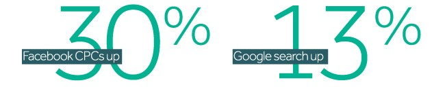
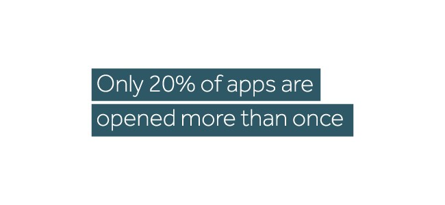
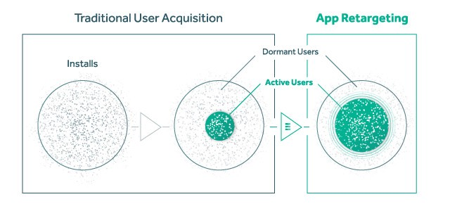
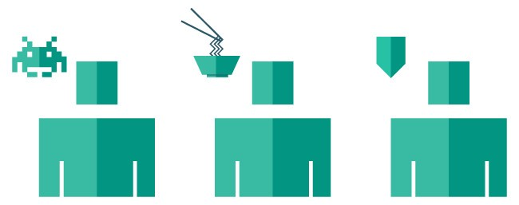
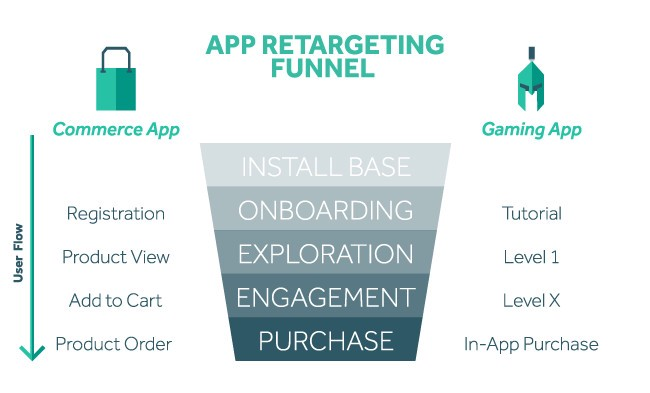
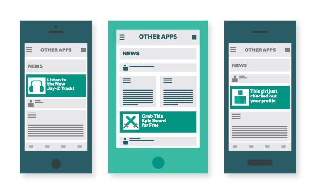
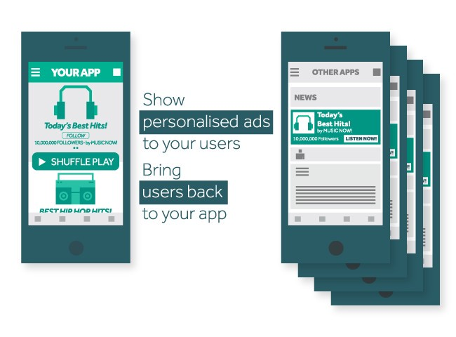

## Foreword

This is a post that has been originally published on [Remerge](https://www.remerge.io/) website in 2018.

## Intro

The dynamic environment of the mobile marketing industry has seen some huge developments over the last few years. New technologies, changing user behaviours, vicious app chart battles and alternative marketing approaches have opened up a whole new set of opportunities for brands to interact with their audiences more personally than ever before.

## At First There Was Acquisition

Until fairly recently, the focus has been almost exclusively on boosting user numbers and optimising ad spend toward ROI, typically based on the cost per install model. Customer acquisition costs tended to relate to what kind of revenue users were expected to generate over a specific time period: aka their lifetime value and projected gross profit.
Which is all well and good but what happens when you reach market saturation? The cost of acquiring new users is on the rise, with Facebook CPCs up 30% and Google search 13% over the space of just a year.

Another issue app developers are facing is [user retention](http://venturebeat.com/2015/03/16/the-big-problem-with-retention-in-mobile-gaming/). Rather worryingly, over 60% of apps are used less than 10 times, and only 20% of apps are opened more than once, once! Even the most rigorous and well developed mobile marketing strategies need to involve checking in on customers as time goes on to make sure you’re still focusing on the right things. SocialCam and Draw Something are cruel examples of the reality of user churn, having lost more than 80% of monthly active users over 6 months (see [Merkle’s Digital Marketing Report from Q3](http://www.rimmkaufman.com/digital-marketing-report/)).

## Enter the Age of Engagement

Marketers have come to realise that there’s more to mobile marketing than first met the eye. User acquisition needs to be accompanied by a strong effort to increase engagement — up-selling and re-activating your audience.

## Know Your User

The beauty of retargeting lies in 1st party data usage, ie. the data you’ve collected directly from your user. It could be **demographic data** entered when registering like age or location, or **behavioural data** you’ve gathered yourself such as what type of cuisine they tend to order, what level in the game they have reached or what type of music they like. These kinds of insights are of course hugely valuable, enhancing our understanding of users’ needs and wants, and giving us a comprehensive picture of their behavioural patterns.

## Segment the Smart Way

1st party data naturally opens up a host of opportunities to accurately target existing customers. By adopting a **granular segmentation** approach you can group your visitors and users based on their various past activities and get an understanding of the user’s journey through the purchase funnel. A great place to start is with those high-intent users — think shopping cart abandoners or people who’ve checked out specific product pages. These are the users who’ve already expressed an interest and probably just need a little reminder or added incentive to convert.

## Get Personal

In such a fragmented ecosystem, a personalised user experience is key to building up a relationship and fostering engagement. So once you’ve identified and segmented your user, you can push them further down your marketing funnel to tailor their experience that crucial bit more by showing them interesting ads and engaging messages which **appeal to them specifically**, based on their history.

You can get as creative as you like with your ads, depending entirely on what kind of message you want to send. Whether you want to highlight your current offers or send your top (monetising) users to your latest release, there are more or less unlimited options.

[Deep links](https://en.wikipedia.org/wiki/Mobile_deep_linking) go that next step further to let you effectively redirect to a particular product or specific app landing page, steering clear of simple home page referrals. Retargeting crosses app and vertical boundaries too, meaning you might appear in front of your user again while they’re doing some online shopping, on social media, playing a game or just browsing the internet, as you like.

## Reap the Benefits

Another great benefit of retargeting of course being that, in a similar way to lookalike campaigns, strong data-driven advertising typically yields lower costs and higher conversion rates — usually at around 70% the cost of acquisition, and boosting ad and in-app revenue in the meantime. In the end you end up with more budget to allocate to your CPI (cost per install) along with healthy retention levels aka. engaged, returning users.
It’s All About Balance
That all said, the two will always go hand in hand. While app retargeting is still a relatively new player in the field of mobile advertising, the complementary relationship between the two approaches is abundantly clear: a **user base needs active users**. A solid acquisition strategy needs to be followed up with a solid engagement and retention strategy that looks to increase the lifetime value of your users beyond the install. Essential is finding the perfect harmony between the two to understand why a user lost interest and what it takes to get them back on board.
