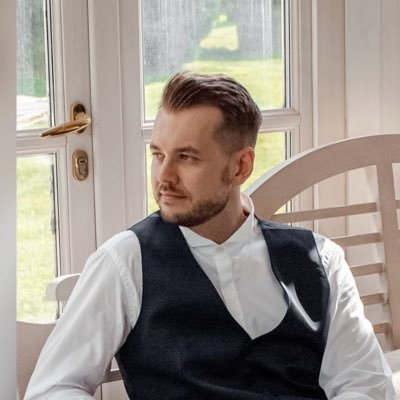
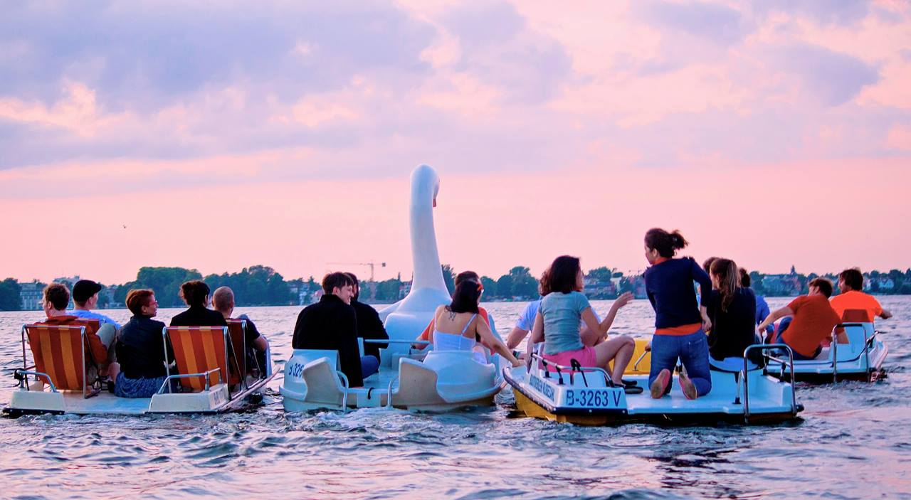
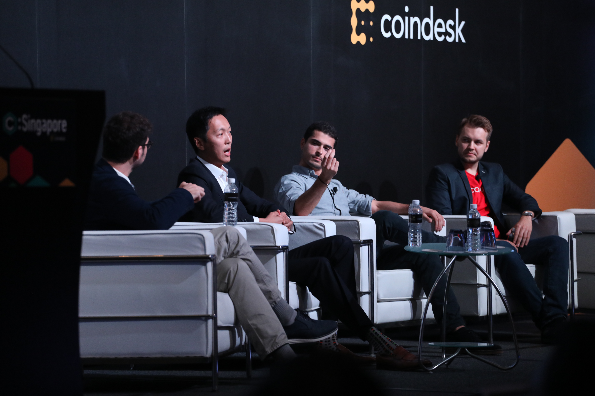

Hey there 👋, thanks for checking a more extensive version of my humble brag page!

## Why

This corner of the internet exists because of continuously seeking greater understanding. It aims to fulfil a genuine desire and insatiable curiosity to comprehend the complexities of the world and the people within it. It cultivates the qualities that encourage growth, empathy, and connection. By going beyond surface-level judgment and assumptions, it opens the door to richer and more meaningful interactions. This is a mechanism to cope with the chaos and eternal change of the world, as well as to do my best to exercise open-mindedness, compassion, and kindness.

## Who

Hey, I am Kirill and this is a unique twist on my bio on the homepage. Beyond professional achievements and trying to showa pitch-perfect picture of our identities, I primarily think of myself as a curious human being, a husband, a tinkerer, an occasional writer, a citizen of the world, and a person of integrity.

## What

### Milestones

**2010** - Landed my first job in a [private equity fund](https://www.enercap.com/) and helped raise **over $200m in debt financing** for renewable energy projects in CEE. These wind, solar and biomass projects have been saving 130,000 tonnes of carbon p.a. powering 200,000 households.

**2011** - Started my first startup that copied a [business model](https://venturebeat.com/business/a-brief-history-of-fab-from-mega-hype-to-crash-and-burn/) from the US. After incorporation, printing flyers and business cards, we realised we had 0 customers. A few lessons I’ve learned on how NOT to start a company.

**2012** - Moved to Berlin during the start-up boom and joined a [venture studio](https://ioniq.com/portfolio/). The company portfolio now spans FinTech, AdTech and HealthTech companies. This has been an interesting experience looking back based on the macro and micro lens of technology cycles. We saw mobile overtaking web traffic from the front-row seats.

**2014** - Started a mobile-first user acquisition agency and reached **$30k in revenue in the first month**. It was my first digital nomad experience whilst living and travelling in Thailand. Unfortunately, my bank sent me a cease and desist letter a year later and I had to shut down. I learned a lot about perseverance, stress, independence, and non-default paths.

**2015** - Joined a [seed stage startup](https://venturebeat.com/2014/10/03/1-million-seed-funding-led-by-point-nine-capital-investing-in-remerge-was-a-no-brainer-for-us/) in Berlin and went from 0 revenue to one of the industry leaders in mobile advertising. We grew **from 10 people to 100 employees** and I was lucky to experience a true **0 to 1 startup scale-up story**, including the go-to-market in 7 different countries.

**2016** - Took a short career break and spent time with my family during which I accidentally learned about Ethereum. Took part in the first crypto wave, which was well described [in this book](https://amzn.to/3FiMnpD). I also spent some time learning to code, but didn't follow through. It was also the first year of my forte in newsletters and I convinced 300 poor souls that I had something important to say.

**2018** - Made a move to Singapore and worked with the largest C2C marketplace in SEA on a platform utilising blockchain and external data to identify threats and bad actors. Met some of the most amazing entrepreneurs in the region and engraved myself in the start-up ecosystem.

**2020** - Got accepted into an [early-stage start-up program](https://www.antler.co/) and worked on a machine learning product to help push models into production faster. I learned a lot. Not only about the economics of VCs, which is a very popular topic these days, but also about intrinsic motivation and being able to quit.

**2021** - A complete professional fiasco. I got a chance to interview for my dream job, completely messed it up and ended up in a toxic environment, followed by a stint in a feature factory.

**2022** - Recovered and balanced my life. I focused on cementing myself in the organisation as an expert in my domain, as well as trying to level up skills such as experimentation, technical architecture and stakeholder management. I learned a lot, especially how different it is working at a scale where every decision can result in millions of revenue (or losses).

**Now (October 2023)** - I am currently in the middle of personal and professional transition. More to come!

### Investments

Private:

- [Calm company fund](https://calmfund.com/)
- [Replit](https://replit.com/)

Public:

- [$VWRA](https://www.vanguardmexico.com/en/products/financial-products/equity-etf/VWRA)
- [$COIN](https://www.google.com/finance/quote/COIN:NASDAQ?sa=X&ved=2ahUKEwjTjYvU4K6EAxWjcGwGHf3RD68Q3ecFegQIRxAf&window=MAX)
- [$U](https://www.google.com/finance/quote/U:NYSE?window=MAX)
- [$SE](https://www.google.com/finance/quote/SE:NYSE?window=MAX)

### Interests

#### Code

I am currently in the middle of studying part-time. A lot of my friends raised eyebrows and asked why would I do that in the era of ChatGPT and the possibility of hiring others. I plan to write an article on why I think learning is worth it. But TL;DR is that there is to cultivate a [builder's mindset](https://builders.genagorlin.com/p/the-builders-mindset-a-way-out-of) to generate things that AI won't ever be able to do.

#### Design

In combination with the above, I am also learning about UX/UI and accessibility. I think design is a really underrated moat for a lot of products and is taken as a default trust factor into whether the product is worth it.

#### Communities

In 2023, I am shifting away from online and towards offline and proximity-based communities. I don't feel like X or online forums really sparked a feeling of belonging and I am working on something small to make this happen.

I am obsessed with the idea of [French Salons a "rave for intellect"](https://thesalonhost.com/what-is-a-salon/). My belief is that a lot of loneliness and mental health issues come from the lack of 3rd places in the world and support systems, particularly for males. I am exploring how this can be fixed.

#### Calm companies

I've been trying to scout for calm companies via Calm Company Fund. It is challenging to find a balance where founders are either beyond profitability and don't want to sell or too early where they actually are profitable.

#### ~~Second brain~~

This has been a major downer given that I spent so much time on it. I see people spend time on configuring PKM systems to produce a worthy writing output but fall short in actually producing (like me). Doing is worth 50x more than organising. [The flaws of PKM systems are clear](https://sashachapin.substack.com/p/notes-against-note-taking-systems). However, I don't think the problem is in the concept of the second brain or PKM, it's the ecosystem around that promotes procrastination over output. It doesn't matter how many dots you have on the graph.

## Principles

- Living an examined and calm life
- Exploration & experimentation
- Seeking mastery & expertise
- Beginner's mind and art of starting from scratch
- Lifelong learning and forever student
- Non-convention and non-conformity
- Simplicity and minimalism
- Virtue cultivation. Alternatively
- Individual journey and direction
- Bits of hungriness and foolishness

## End

[My DMs are always open](https://www.twitter.com/kirso_). Alternatively, you can [book a call](https://cal.com/kirso).
